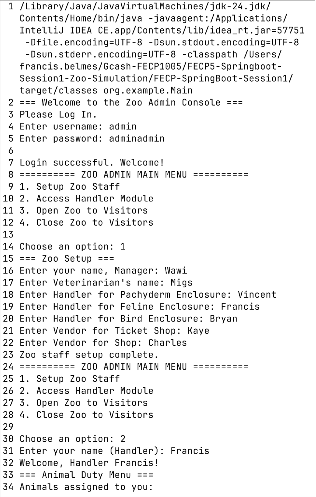
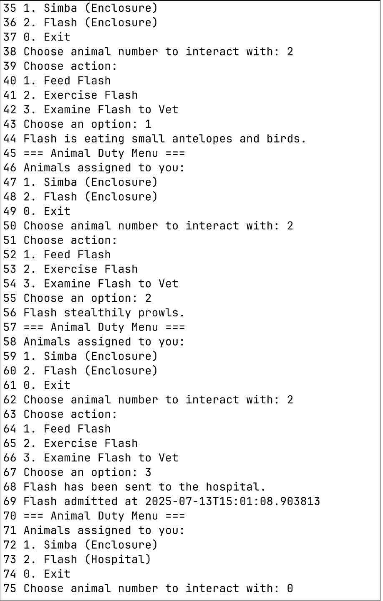
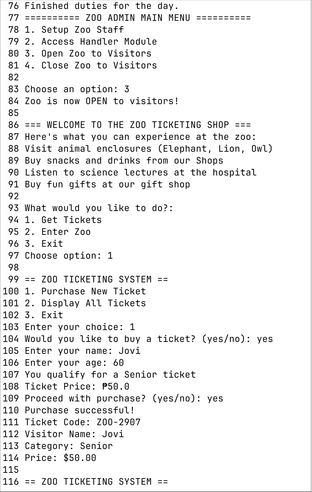
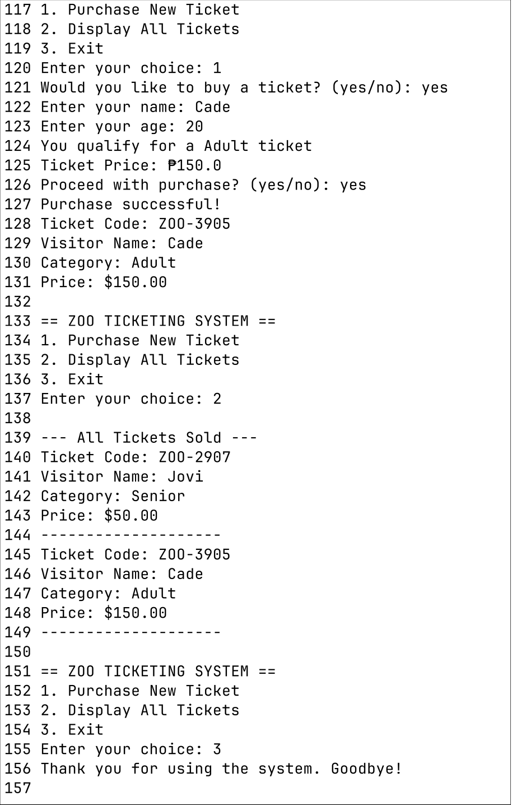
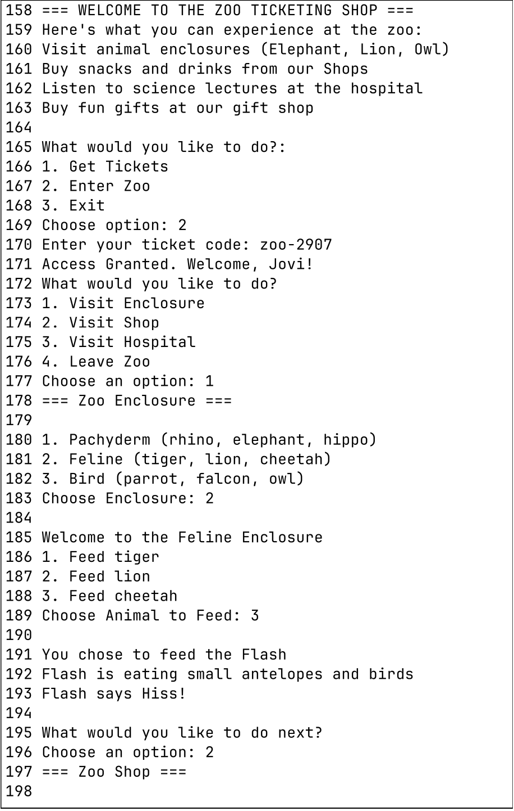
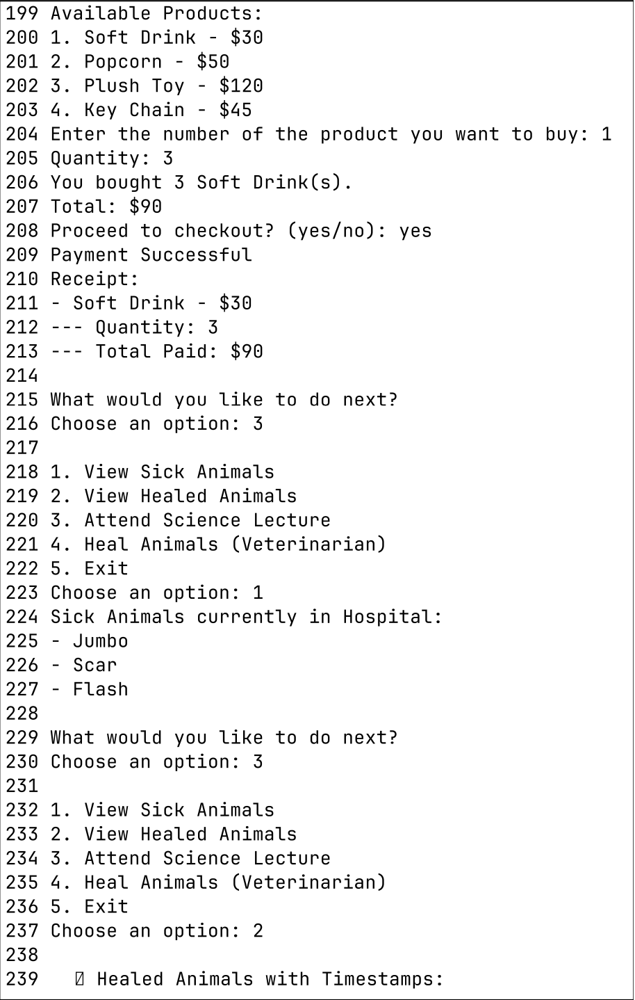
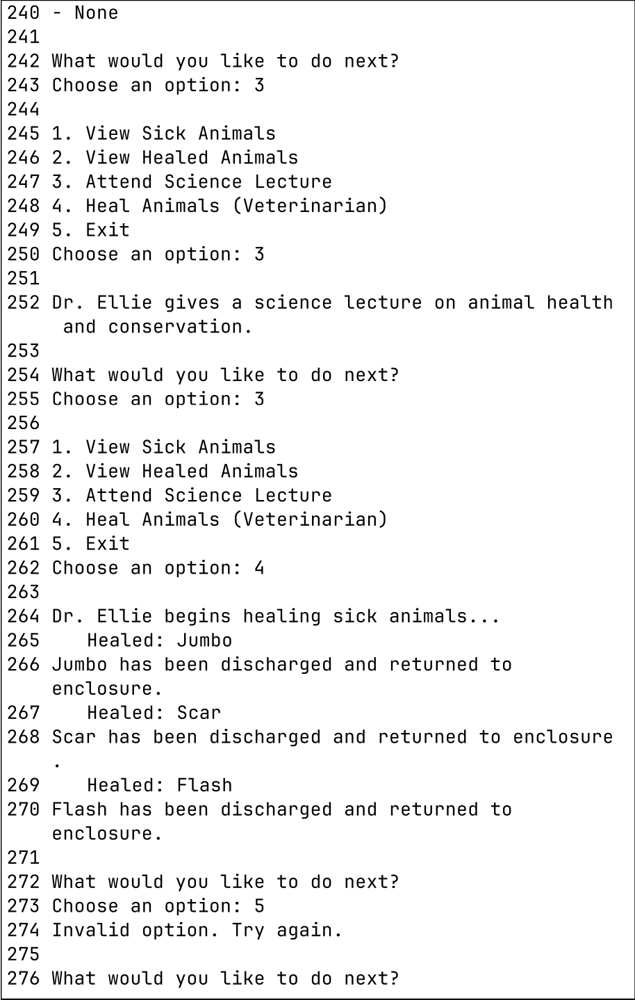

# Group 12 - ABS
### Group Members:
1. Alcoriza, Marc Vincent
2. Belmes, Francis Aldrin
3. Santos, Harold Bryan
***
### Project Title:
Zoo Simulation - UML Class Diagram to Java Program
***
### Project Description:
This project involves the design and implementation of a comprehensive, text-based Zoo Management System in Java. The primary objective is to translate a conceptual UML class diagram into a functional, interactive console application. The system is divided into three core modules: an administrative backend for staff, a public-facing ticketing system for visitors, and an immersive zoo simulation for ticket holders to explore.
***
### Output:

